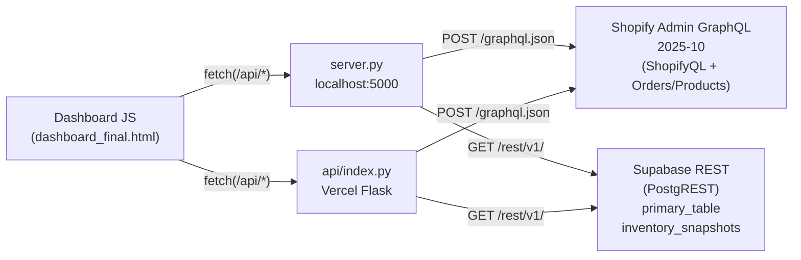
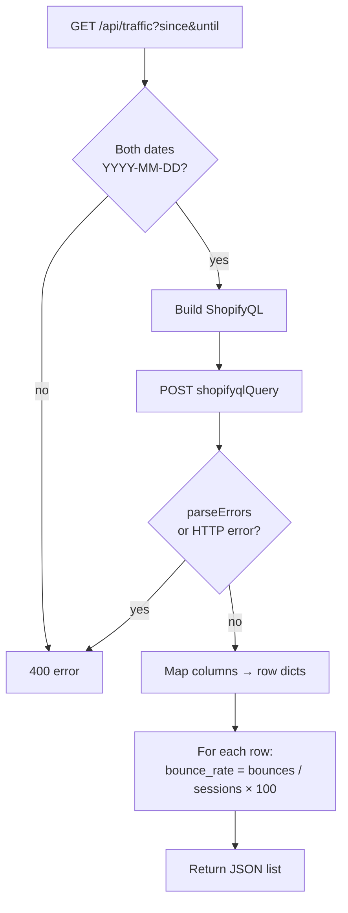
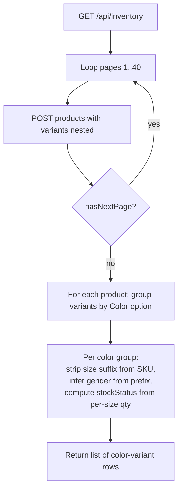

# Saadaa Ops Dashboard — Backend Guide

Backend logic, every endpoint, every filter. UI / dashboard is not covered here.

The backend has **two interchangeable implementations** that expose the same
HTTP API surface:

| Implementation | File | Use case |
|---|---|---|
| Local dev server | [`server.py`](./server.py) | `python server.py` → `http://localhost:5000`. BaseHTTPServer-based. |
| Vercel function | [`api/index.py`](./api/index.py) | Deployed at `https://landing-page-three-blush.vercel.app/api/*`. Flask app. |

Both read from the same upstreams (Shopify Admin GraphQL + Supabase REST)
and return identical response shapes. Field-for-field equivalence is
maintained on purpose so the dashboard JS doesn't care which one it's
hitting.

---

## 1. High-level architecture



---

## 2. Environment variables

Loaded from `.env` at startup (via `python-dotenv`). All four are required;
missing Shopify creds raise `SystemExit` immediately.

| Var | Where used | Purpose |
|---|---|---|
| `SHOP_DOMAIN` | Shopify endpoint URL | `https://{SHOP_DOMAIN}/admin/api/2025-10/graphql.json` |
| `ADMIN_ACCESS_TOKEN` | `X-Shopify-Access-Token` header | Custom App access token; must carry `read_reports` scope or `shopifyqlQuery` is hidden by the API |
| `SUPABASE_URL` | Supabase REST base | `{SUPABASE_URL}/rest/v1/{table}` — ads project (primary_table / inventory_snapshots) |
| `SUPABASE_SERVICE_KEY` | `apikey` + `Authorization: Bearer` headers | Service role key for the ads project |
| `SAADAA_VAR` | Second Supabase project REST base | Sessions + orders project (`sessions`, `orders`, `order_line_items` tables). Optional — when present, `/api/traffic` and `/api/orders` read from here first and fall back to Shopify only if the call fails. (Name chosen to avoid colliding with `SUPABASE_URL` which already points at the ads project.) |
| `SAADAA_KEY` | Auth headers for the second project | Service role key for the sessions + orders project |

---

## 3. HTTP routes

| Method | Path | Source | Required params |
|---|---|---|---|
| `GET` | `/` | static | — | serves `dashboard_final.html` |
| `GET` | `/api/health` | local | — | returns `{ status: "ok", shop: SHOP_DOMAIN }` |
| `GET\|POST` | `/api/traffic` | ShopifyQL `sessions` | `since`, `until` (YYYY-MM-DD) |
| `GET\|POST` | `/api/inventory` | Shopify Admin GraphQL `products` | — |
| `GET\|POST` | `/api/sales` | ShopifyQL `sales` × 2 | `since`, `until` |
| `GET\|POST` | `/api/orders` | Shopify Admin GraphQL `orders` | `since`, `until` |
| `GET` | `/api/ads` | Supabase REST `primary_table` | optional `since`, `until` |
| `GET` | `/api/inventory-snapshot` | Supabase REST `inventory_snapshots` | optional `date` |

All `POST` variants accept the same params either in JSON body or query
string. CORS is open (`Access-Control-Allow-Origin: *`).

---

## 4. Endpoint deep-dives

### 4.1 `/api/traffic` — Shopify Sessions



**ShopifyQL** (`server.py` / `api/index.py` `fetch_traffic`):

```sql
FROM sessions
SHOW online_store_visitors, sessions, sessions_with_cart_additions,
     added_to_cart_rate, bounces, average_session_duration,
     pageviews_per_session, sessions_that_reached_checkout
WHERE landing_page_path IS NOT NULL
  AND human_or_bot_session IN ('human', 'bot')
GROUP BY landing_page_type, landing_page_path, day,
         utm_source, utm_medium, utm_campaign,
         utm_content, utm_term,
         session_city
WITH TOTALS
SINCE {since} UNTIL {until}
ORDER BY sessions DESC
```

- **No `LIMIT`** — full result set returned.
- `session_city` was added so the dashboard can break sessions down by city.
- `bounce_rate` is **computed server-side** (`bounces / sessions * 100`) and
  injected onto every row before returning — Shopify's own value is
  discarded for consistency.

### 4.2 `/api/sales` — Shopify Sales (two queries)

```mermaid
flowchart TD
    A[GET /api/sales?since&until]
    A --> B{Both dates set?}
    B -- no --> X[400 error]
    B -- yes --> C1[QUERY 1: detail<br/>GROUP BY day, product, order_utm_*, customer, line_item_id]
    A --> C2[QUERY 2: byProduct<br/>GROUP BY product_title, product_type]
    C1 --> D1[POST shopifyqlQuery]
    C2 --> D2[POST shopifyqlQuery]
    D1 --> E[Cast SHOW + __totals fields → float]
    D2 --> E
    E --> F[Return {rows, byProduct}]
```

**Detail query**:

```sql
FROM sales
SHOW net_items_sold, gross_sales, discounts, returns,
     net_sales, taxes, total_sales
WHERE product_title IS NOT NULL
  AND sales_channel != 'Return Prime: Order Return'
GROUP BY day, product_title, product_type,
         order_utm_campaign, order_utm_content, order_utm_medium,
         order_utm_source, order_utm_term,
         line_item_id, customer_id, new_or_returning_customer,
         customer_last_order_date, customer_number_of_orders
WITH TOTALS
SINCE {since} UNTIL {until}
ORDER BY day ASC
```

**byProduct query** (used by the dashboard's main Sales tab so totals
match Shopify's "Total sales by product" report regardless of detail-row
volume):

```sql
FROM sales
SHOW net_items_sold, gross_sales, discounts, returns,
     net_sales, taxes, total_sales
WHERE product_title IS NOT NULL
  AND sales_channel != 'Return Prime: Order Return'
GROUP BY product_title, product_type
WITH TOTALS
SINCE {since} UNTIL {until}
ORDER BY total_sales DESC
```

**Field name caveats** — only the `order_utm_*` columns are exposed by the
Admin API's `sales` dataset. The session-level `utm_source/medium/campaign/
content/term` columns Shopify's UI report editor shows are **not** available
via the API and will fail with `Column Not Found`. `LAST_CLICK_ATTRIBUTION`
is similarly unavailable — none of the SHOW metrics are selectable in
`__last_click` form via the API. Attribution still flows through correctly
because Shopify writes the last-click UTMs onto the order at checkout
(`order_utm_*` = last-click).

**Response shape**:
```json
{
  "rows":      [ {day, product_title, ..., net_items_sold, ..., total_sales, gross_sales__totals, ...}, ... ],
  "byProduct": [ {product_title, product_type, net_items_sold, ..., total_sales}, ... ]
}
```

### 4.3 `/api/orders` — Shopify Orders

Paginated Admin GraphQL fetch, 50 orders per page, **40-page hard cap**
(2000 orders).

```mermaid
flowchart TD
    A[GET /api/orders?since&until]
    A --> B[query_filter = created_at:>={since} created_at:<={until}]
    B --> C[Loop pages 1..40]
    C --> D[POST orders(first:50, query=filter, sortKey=CREATED_AT, reverse=true, after=cursor)]
    D --> E[For each order:<br/>flatten lineItems(first:20),<br/>customAttributes,<br/>shippingAddress]
    E --> F{hasNextPage?}
    F -- yes --> C
    F -- no  --> G[Return flat list]
```

**Per-order fields returned**: `id`, `name`, `createdAt`, `financialStatus`
(`displayFinancialStatus`), `fulfillmentStatus`, `total`, `subtotal`,
`discounts`, `shipping`, `tax`, `refunded`, `currency`, `discountCodes`,
`note`, `tags`, `cancelled` (= `cancelledAt is not None`), `customer`
(name/phone — email is intentionally blank), `address`, `lineItems[]`
(`title`, `variantTitle`, `sku`, `quantity`, `price`, `image`),
`itemCount`, `customAttributes` (dict), `paymentGateway`, `source`.

**Caveats**:
- `lineItems(first: 20)` — orders with > 20 line items will silently lose
  items past the 20th. The 40-page cap means orders past #2000 in a busy
  range are also dropped.
- `customer.email` is intentionally returned blank (Shopify hides email
  on PII-restricted scopes; the dashboard never displays it).

### 4.4 `/api/inventory` — Shopify Products

Paginated `products(first: 50, after: $cursor)` fetch, **40-page cap**
(2000 products), each product expanded into one row per **color variant**.



**Variant-grouping logic** (in `fetch_inventory`):
- Variants are bucketed by their `selectedOptions` value for `color` /
  `colour`. Each bucket becomes one returned row.
- **`colorSku`** = first non-empty SKU in the bucket with the size suffix
  stripped (`_S`, `_M`, `-XL`, `_2XL`, …, `FREE`, `ONESIZE`).
- **`gender`** = SKU prefix → `SD` → Women, `SM` → Men, `SU` → Unisex.
- **`category`** = `productType` overridden by any tag in the set
  `{topwear, bottomwear, dress, co-ord, kurta, shirt, pant, women topwear,
  women bottomwear, men topwear, men bottomwear, women dress}`.
- **`discontinued`** = any tag in `{discontinued, disc, discontinue, disc.}`.
- **`excluded`** = any tag in `{old saadaa product, old saadaa, old product,
  archive, archived, hidden, exclude, excluded, old}`.
- **`stockStatus`** computed from non-null per-size quantities:
  - all sizes = 0 → `out_of_stock`
  - half-or-more sizes = 0 → `broken_stock`
  - otherwise total > 0 → `in_stock`, else `unknown`.

**Size normalization** (`SIZE_MAP`): `XXS→XS`, `XXL→2XL`, `XXXL→3XL`,
`XXXXL→4XL`, `XXXXXL→5XL`, `SMALL→S`, `MEDIUM→M`, `LARGE→L`,
`EXTRA SMALL→XS`, `EXTRA LARGE→XL`.

### 4.5 `/api/ads` — Supabase Meta Ads (primary_table)

**Source of truth for the Ad Intelligence tab.** The older `results_table`
(nested `ads_json`) is no longer used by this dashboard — it's reserved for
the Creative Testing Dashboard, which reads the last-30-day creative
analysis from that table independently.


```mermaid
flowchart TD
    A[GET /api/ads?since&until] --> B[Build PostgREST params:<br/>select=*<br/>order=amount_spent_inr.desc<br/>limit=99999]
    B --> C{since set?}
    C -- yes --> D[Add date=gte.{since}]
    C -- no  --> E[skip]
    D --> F{until set?}
    E --> F
    F -- yes --> G[Add date=lte.{until}]
    F -- no  --> H[skip]
    G --> I[_supabase_get paginate]
    H --> I
    I --> J[Range: 0-999 → 1000-1999 → …<br/>stop when page < 1000]
    J --> K[Concatenate batches]
    K --> L{rows empty AND<br/>since/until was set?}
    L -- yes --> M[Retry without date filter<br/>as a last-resort fallback]
    L -- no  --> N[Return flat row list]
    M --> N
```

**Source table**: `primary_table` (flat: one row per ad per day).

**Filter** (`fetch_ads`):
- `date=gte.{since}` (Postgres `date` type)
- `date=lte.{until}`
- `order=amount_spent_inr.desc`
- `limit=99999` (PostgREST query param, belt-and-braces alongside the
  Range header pagination)

**Pagination** (`_supabase_get`) — works around PostgREST's server-side
`max-rows: 1000` cap (Supabase Free tier default):

```http
Range-Unit: items
Range: 0-999          → first 1000 rows
Range: 1000-1999      → next 1000
Range: 2000-2999      → …
```

Loop continues until a page returns fewer than 1000 rows or until offset
hits 100,000 (safety stop). All batches concatenated into one list.

**Row shape** (every column from `primary_table`): `id`, `account_name`,
`date`, `date_stop`, `ad_created_date`, `ad_name`, `ad_id`, `campaign_name`,
`campaign_id`, `ad_status`, `impressions`, `reach`, `frequency`,
`amount_spent_inr`, `outbound_clicks`, `inline_link_clicks`, `ctr`, `cpc`,
`cpm`, `thruplays`, `three_sec_video_plays`, `video_play_time`,
`purchase_roas`, `purchases`, `cost_per_purchase`, `conversion_value`,
`initiate_checkout`, `add_to_cart`, `post_engagements`,
`checkout_completion`, `atc_rate`, `ci_atc_rate`, `purchase_rate`,
`ftewv_count`, `cost_per_ftewv`, `ncp_count`, `cost_per_ncp`, `ltv_reach`,
`ltv_frequency`, `updated_at`, `preview_link`, `ad_link`.

### 4.6 `/api/inventory-snapshot` — Supabase historical inventory

```mermaid
flowchart TD
    A[GET /api/inventory-snapshot?date=YYYY-MM-DD] --> B{date set?}
    B -- yes --> C[Query snapshot_date eq. date]
    C --> D{rows returned?}
    D -- yes --> E[Return rows + isFallback=false]
    D -- no  --> F[Find latest snapshot_date]
    B -- no  --> F
    F --> G{any snapshots exist?}
    G -- no  --> H[Return rows=[] + isFallback=true]
    G -- yes --> I[Query that latest date]
    I --> J[Return rows + isFallback=date≠actual]
```

**Table**: `inventory_snapshots`. **Filters**:
- `snapshot_date=eq.{date}` exact match.
- Fallback: `order=snapshot_date.desc&limit=1` finds the most recent
  available date.

**Response**: `{ rows, date, requestedDate, isFallback }`. `isFallback` is
`true` when the requested date had no rows and the latest available date
was substituted.

---

## 5. Cross-cutting concerns

### 5.1 Shopify GraphQL plumbing

Both files share helpers:
- `_shopifyql(ql)` / `_shopifyql_table(ql)` — POSTs `shopifyqlQuery(query: $ql)`
  to `/admin/api/2025-10/graphql.json` and returns the `tableData` block.
- `_shopifyql_rows(table)` / `_table_to_rows(table)` — flattens
  array-rows into column-keyed dicts when Shopify returns rows-as-arrays
  (it varies by query shape).
- `_gql(query, variables)` — generic non-ShopifyQL Admin GraphQL helper
  used by `fetch_inventory` and `fetch_orders`.

All Shopify calls hit **API version 2025-10**. (2024-10 was tried earlier
but rejected `shopifyqlQuery` with `Field 'shopifyqlQuery' doesn't exist
on type 'QueryRoot'` — the field's location changed between versions.)

### 5.2 Supabase REST plumbing

`_supabase_get(table, params)`:
- Headers: `apikey`, `Authorization: Bearer …`, `Content-Type:
  application/json`, `Range-Unit: items`.
- Paginates with `Range: N-N+999` until a page returns < 1000 rows.
- Hard safety stop at 100,000 rows.
- Timeout: 60s per page.

### 5.3 Date semantics

Every `since`/`until` accepted by the API is **YYYY-MM-DD**:

- Shopify ShopifyQL uses **shop timezone** (IST for this store) — so
  `SINCE 2026-05-16 UNTIL 2026-05-16` is `2026-05-16 00:00 IST → 2026-05-16
  23:59 IST`.
- Shopify Orders REST query (`created_at:>=2026-05-16 created_at:<=2026-05-16`)
  also interprets in shop timezone.
- Supabase `primary_table.date` is a plain `date` type (no timezone). The
  `gte.{since}` / `lte.{until}` filters are pure date comparisons.

### 5.4 Numeric casting

`SALES_NUMERIC_FIELDS = (net_items_sold, gross_sales, discounts, returns,
net_sales, taxes, total_sales)`.

After every ShopifyQL fetch, each row's numeric SHOW fields **and** the
`{field}__totals` columns Shopify appends when `WITH TOTALS` is on are
cast to `float` (empty/None → 0). Dimension fields are coerced from
`None` → `""`. The client never has to `parseFloat` again.

### 5.5 Error handling

| Failure | HTTP response |
|---|---|
| Missing creds | 500 with `{"error": "Server credentials not configured"}` |
| Missing `since`/`until` | 400 |
| Shopify HTTP error | 502 with `Shopify HTTP error: {exception}` |
| ShopifyQL `parseErrors` | 400 with the ShopifyQL error array verbatim |
| GraphQL `errors` field | 400 |
| Anything else | 500 |

---

## 6. Complete filter reference

| Endpoint | Filter / param | Behaviour |
|---|---|---|
| `/api/traffic` | `since`, `until` (required, YYYY-MM-DD) | Maps to ShopifyQL `SINCE {since} UNTIL {until}`. Date alone — Shopify expands to shop-tz day. |
| `/api/traffic` | — | Hard-coded `WHERE landing_page_path IS NOT NULL AND human_or_bot_session IN ('human','bot')`. Bots are intentionally **not** excluded by this filter — only sessions whose `human_or_bot_session` is one of those two known values. |
| `/api/traffic` | — | `GROUP BY landing_page_type, landing_page_path, day, utm_source, utm_medium, utm_campaign, utm_content, utm_term, session_city WITH TOTALS`. |
| `/api/traffic` | — | `ORDER BY sessions DESC`. No `LIMIT`. |
| `/api/sales` | `since`, `until` (required) | Two queries fire in series, both filtered on the same range. |
| `/api/sales` | — | `WHERE product_title IS NOT NULL AND sales_channel != 'Return Prime: Order Return'`. Return Prime entries always excluded — this is the only fixed exclusion. |
| `/api/sales` | — | Detail GROUP BY: 13 dimensions (day, product, all 5 order_utm_*, line_item_id, customer_id, new_or_returning_customer, customer_last_order_date, customer_number_of_orders). |
| `/api/sales` | — | byProduct GROUP BY: `product_title, product_type`. |
| `/api/sales` | — | `WITH TOTALS` in both; `__totals` columns appear on every detail row. |
| `/api/orders` | `since`, `until` (required) | Maps to Admin GraphQL `query: "created_at:>={since} created_at:<={until}"`. |
| `/api/orders` | — | `sortKey: CREATED_AT, reverse: true`. Pagination uses `endCursor`. |
| `/api/orders` | — | **Hard cap** = 40 pages × 50 = **2000 orders**. Per-order `lineItems(first: 20)`. |
| `/api/orders` | — | No status / tag / cancel filtering at the backend. **Every** order in range is returned; the dashboard filters cancelled / tagged orders client-side. |
| `/api/inventory` | — | No filter — every product fetched in 50-page batches up to 40 pages. |
| `/api/inventory` | — | Variants split into one row per **color value**. Products without `Color` selectedOption become a single `"Default"` color row. |
| `/api/inventory` | — | Per-product `discontinued`/`excluded` derived from tags (see §4.4). |
| `/api/ads` | `since`, `until` (optional) | If set, adds `date=gte.{since}` and `date=lte.{until}` to PostgREST query. |
| `/api/ads` | — | `order=amount_spent_inr.desc, limit=99999`. Plus Range-based 1000-row pagination loop. |
| `/api/ads` | — | If filtered query returns 0 rows AND a date filter was sent, retries unfiltered as a fallback so the dashboard at least has something to render. |
| `/api/inventory-snapshot` | `date` (optional, YYYY-MM-DD) | If set: `snapshot_date=eq.{date}`. |
| `/api/inventory-snapshot` | — | If no rows for requested date (or no date sent), looks up the latest available `snapshot_date` via `order=snapshot_date.desc&limit=1` and returns that day's rows with `isFallback=true`. |
| `/api/inventory-snapshot` | — | `limit=5000` per snapshot-day query (handled by PostgREST query param, not Range pagination). |

---

## 7. Known caveats

1. **`/api/orders` 2000-row cap.** Busy days that exceed 2000 orders will
   silently drop the rest. If this becomes a problem, the fix is to bump
   `max_pages` past 40 in `fetch_orders`, or to switch to incremental
   pagination keyed on `updated_at`.
2. **`lineItems(first: 20)` in orders.** Orders with > 20 line items lose
   the tail. Re-query with a higher `first` if you have actual orders
   regularly exceeding 20 items.
3. **Customer email not exposed.** `customer.email` is intentionally left
   blank in `/api/orders`. The dashboard never relies on it.
4. **Session-level `utm_*` not available in `sales`.** The Shopify report
   editor lets you `GROUP BY utm_source` against the `sales` dataset, but
   the Admin GraphQL API doesn't — those fields only exist on the
   `sessions` dataset. The sales side carries `order_utm_*` instead
   (= last-click already stamped onto the order at checkout).
5. **`LAST_CLICK_ATTRIBUTION` keyword not usable via API.** Documented
   inside `fetch_sales`. The user-side editor query can compile with it;
   the API requires an attributable metric in `SHOW` and none of the
   seven SHOW metrics are selectable in their `__last_click` form.
6. **Supabase Free-tier 1000-row cap.** PostgREST's `max-rows = 1000`
   server-side setting cannot be overridden by `Range` header or `?limit=`
   query param alone. `_supabase_get` paginates with successive 1000-row
   `Range` requests to work around this.
7. **`fetch_refunds_in_range` is deprecated.** Kept only to avoid breaking
   any older import paths. Don't call from new code — `fetch_sales`
   already returns the exact `returns` numbers Shopify Analytics shows.
